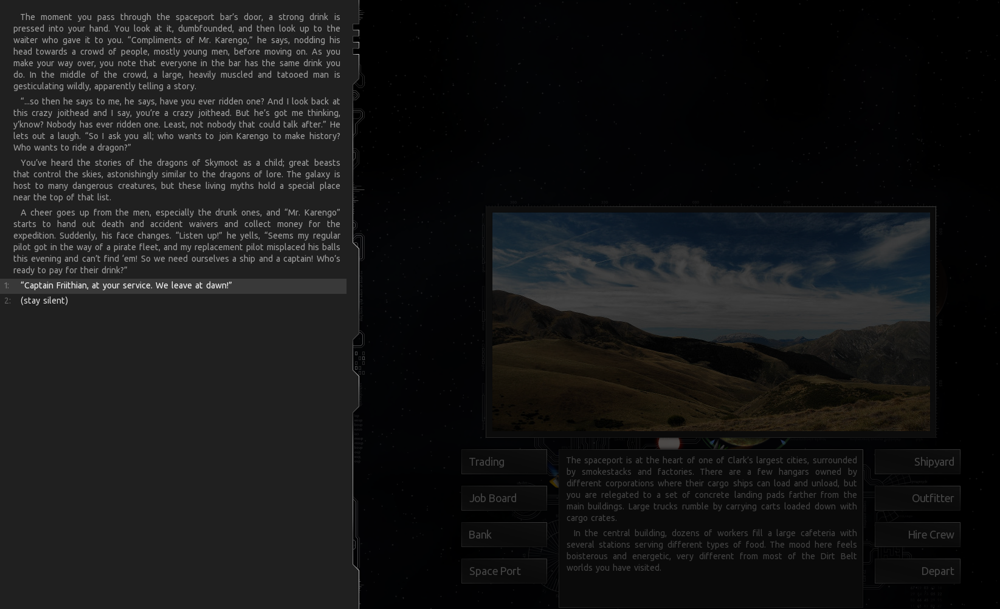

# Dangerous Games missions

## Missions
1. The Dragonriders [Complete]
2. Into The Depths [WIP]

## Intro
This is a series of missions for the (free) game [Endless Sky](https://endless-sky.github.io/) that take you on high-risk, high-adventure trips around the galaxy.

## Installation

Move [the latest release](https://github.com/davidwhitman/endles-sky-dangerous-games/releases), unzipped, to your plugins folder, the location of which can be found here: https://github.com/endless-sky/endless-sky/wiki/CreatingPlugins

## Starting
To begin, head to the planet Clark in the Seginus system. You must be able to carry at least 10 passengers.
